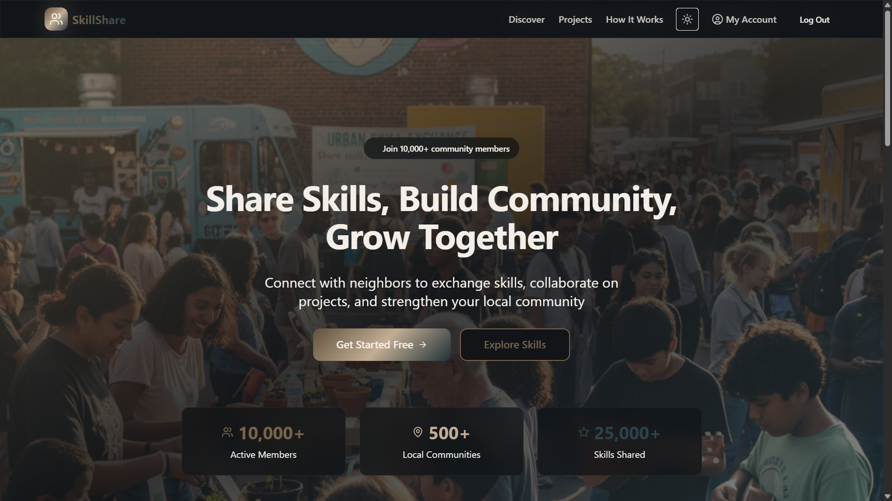
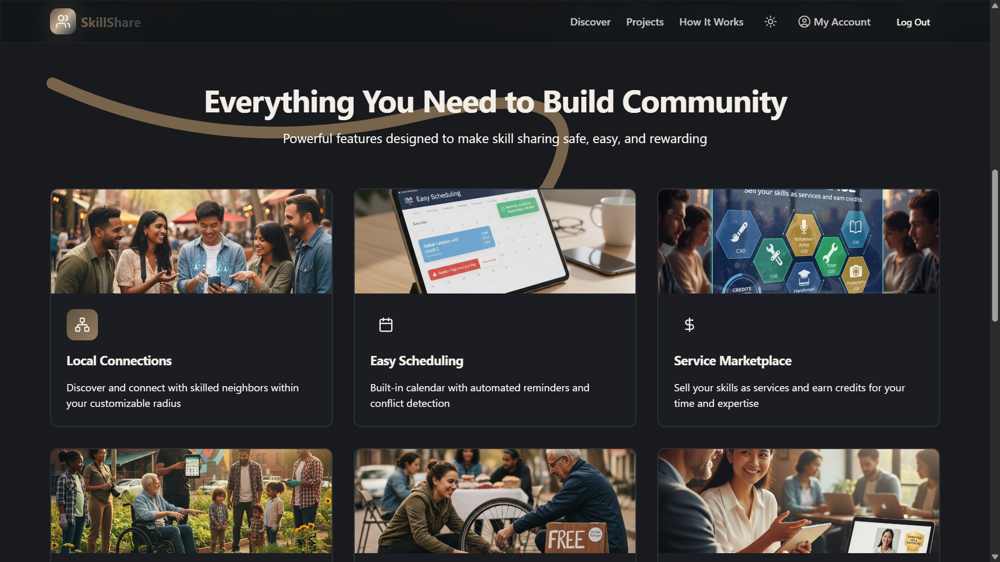
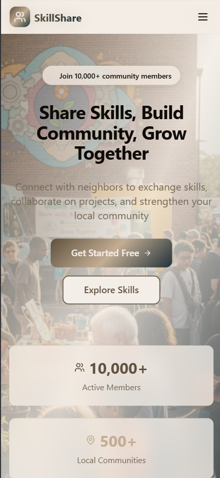
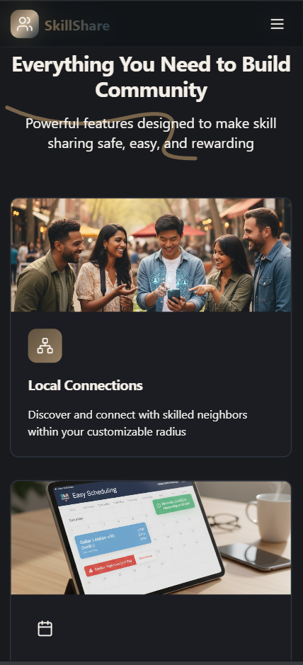

# 🤝 SkillShare Community Marketplace

## Project Overview

**SkillShare** is a full-stack, real-time application designed to connect individuals for local skill exchange, learning, and collaborative projects. It transforms a basic social platform into a thriving local economy by integrating powerful features for community engagement.

### Core Features
- **Real-time Geo-Visualization**: Map view of skilled users in the local area
- **AI-Driven Matching**: Initial user suggestions based on your learning goals
- **Session Scheduling & Marketplace**: Schedule classes, join public sessions, and sell services for community credits/tokens
- **Real-time Communication**: Private 1:1 chat capability between users

---

## 🛠 Tech Stack

The project is built as a complete MERN stack application with real-time capabilities.

| Category | Technology | Purpose |
|----------|-----------|---------|
| **Frontend** | React (Vite), Tailwind CSS | UI components and application logic. Utilizes modern hooks and components |
| **Real-time** | Socket.io-Client | Establishes persistent connection for instant private messaging |
| **Mapping** | Leaflet / React-Leaflet | Interactive map visualization for discovering nearby users |
| **Scheduling** | React-Datepicker | Provides intuitive calendar interface for session management |
| **Backend** | Node.js (Express) | RESTful API server |
| **WebSockets** | Socket.io | Manages real-time connections, message routing, and authentication |
| **Database** | MongoDB (Mongoose ODM) | Stores users, skills (offered/learning), services, sessions, and messages |
| **Authentication** | JWT | Secure token-based access control |

---

## ✨ Key Features Implemented

### 1. User Profiles & Goals
Includes fields for **Skills I Offer** and **Skills I Want to Learn**.

### 2. AI-Based Matching
On initial load, the Discover page prioritizes suggesting users whose offered skills match the logged-in user's learning goals.

### 3. Local Discovery with Map
- Search and filter local users by name, location, and skills
- Map visualization displays the location of nearby members fetched from the API

### 4. Real-Time Private Chat (1:1)
Users can start a secure, instant message conversation directly from another user's profile.

### 5. Service Marketplace
- Users can list services (e.g., "1-Hour Plumbing Help") with a price in credits
- Users can purchase services, with simplified backend transaction logic to debit credits

### 6. Scheduling Dashboard
- Users can schedule new sessions (classes/workshops)
- Calendar view tracks sessions the user is teaching or attending
- "Browse Sessions" tab allows users to join upcoming classes

### 7. Community Projects
Users can propose and volunteer for local community projects.

---

## 🚀 Setup and Installation

Follow these steps to get the SkillShare application running locally.

### Prerequisites
- Node.js (v18+) and npm/yarn
- A running instance of MongoDB (local or cloud-hosted, e.g., MongoDB Atlas)

### Step 1: Clone the Repository

```bash
git clone [Your Repository URL Here]
cd [Your Repository Name]
```

### Step 2: Backend Setup (`/server` folder)

1. Navigate into the server directory:
   ```bash
   cd server
   ```

2. Install dependencies:
   ```bash
   npm install
   ```

3. Install real-time libraries:
   ```bash
   npm install socket.io
   ```

4. Create a `.env` file in the `/server` directory and configure your MongoDB connection and secrets:
   ```env
   PORT=5000
   MONGODB_URI="mongodb+srv://<USER>:<PASS>@<CLUSTER>/skillsharedb?retryWrites=true&w=majority"
   JWT_SECRET="YOUR_VERY_STRONG_SECRET_KEY"
   ```

5. Seed the database (required for testing map and sessions):
   ```bash
   node seed.js
   ```

6. Start the backend server:
   ```bash
   npm run dev
   ```

### Step 3: Frontend Setup (`/client` folder)

1. Open a new terminal tab and navigate into the client directory:
   ```bash
   cd ../client
   ```

2. Install dependencies, including the necessary client-side libraries:
   ```bash
   npm install
   npm install socket.io-client react-leaflet leaflet react-datepicker date-fns
   ```

3. Start the frontend development server:
   ```bash
   npm run dev
   ```

4. The application will be accessible at `http://localhost:5173` (or the port specified by your Vite/React setup)

---

## 🖼️ Application Demonstration




<p allign="center">
  
  
</p>

Video: https://drive.google.com/file/d/1DVrVwEtggKhAEJCGj_S2yb4FEOmwKvRA/view?usp=sharing

---

## 🔗 Project Links

| Resource | Link |
|----------|------|
| **Live Deployment** | https://skillshare-frontend.vercel.app |
| **Project Repository** | https://github.com/Tanim-10/IIT-Hackathon |
| **Project Report / Documentation** | https://drive.google.com/file/d/1JbPRiyOrcOACgO6bnZ8J31SU4bL_N2fT/view?usp=sharing |

---


